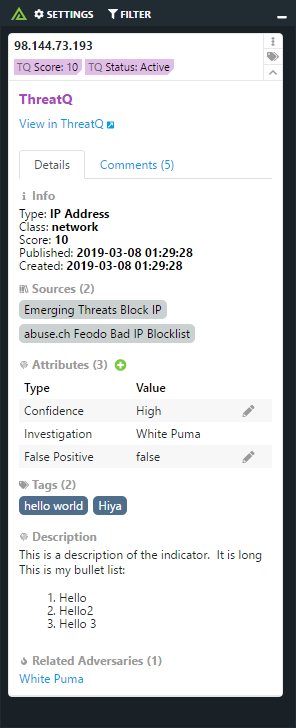
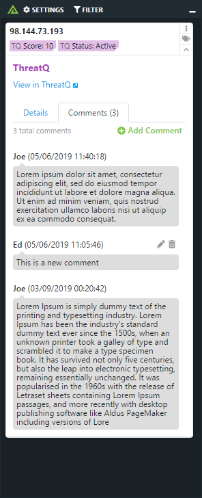

# Polarity ThreatQuotient Integration

Polarity's ThreatQuotient integration gives users access to automated MD5, SHA1, SHA256, IPv4, IPv6, CIDR, and Domain lookups within the ThreatQ threat operations and management platform.

> ThreatQ™ is a threat intelligence platform designed to enable threat operations and management for your security organization. For more information please visit [https://www.threatq.com/](https://www.threatq.com/)

|  |  |
|---|---|
|*ThreatQ Indicator Tab* | *ThreatQ Comments Tab* |


## Configuring Indicator Types

The ThreatQ integration requires that you provide a mapping of indicator types to their respective indicator IDs in your
ThreatQ instance.  This information can be configured in the `config/threatq.config.js` file under the `threatQIndicatorTypes`
property.  This property is an object which has a supported indicator type as the key, and the numeric ID value for that type.
As each ThreatQ instance has different indicator IDs you will need to modify this value with your own indicator IDs.

The supported indicator types are:

* ipv4
* email
* domain
* md5
* sha1
* sha256
* url

You can specify the indicator ID for each type like this:

```
  threatQIndicatorTypes: {
    ipv4: 11,
    email: 3,
    domain: 8,
    md5: 12,
    sha1: 16,
    sha256: 17,
    url: 21
  }
```

The simplest way to get the indicator type values is to login into your ThreatQ instance via your browser, and then navigate
to the following URL:

```
https://<your-threatq-server>/api/indicator/types
```

> Note that if this endpoint returns an empty result `{}` your account does not have access to view the indicator types. 
Please contact your ThreatQ administrator for these values if you are unable to access the above endpoint.

## Configuring Attributes

The ThreatQ integration supports providing a list of Indicator Attributes you would like displayed in the Overlay Window.
These attributes are configured in the `config/threatq.config.js` file under the `threatQAttributes` property.

The `threatQAttributes` property is an array of attribute objects where each attribute object has the following required
and optional properties:

* `name` (Required) - A string name for the attribute which should match the name of the attribute in ThreatQ (case sensitive)
* `editable` (Required) - A boolean indicating whether the attribute can be edited by users (including deletion)
* `values` (Optional) - An array of possible string values for the attribute

```
{
    threatQAttributes: [{
        name: 'Investigation',
        editable: false
    },
    {
      name: 'Confidence',
      editable: ['low', 'medium', 'high']
    },
    {
      name: 'False Positive',
      editable: true,
      values: ['true', 'false']
   }]
}
```


## ThreatQuotient Integration Options

### ThreatQuotient Server URL

The URL for your ThreatQ server which should include the schema (i.e., http, https) and port if required.

### Username

Your TQ username you want the integration to authenticate as (typically an email address).

### Password

The password for the provided username you want the integration to authenticate as.

### Client ID

The Client ID for your ThreatQ deployment. (accessible at `https://<yourserver>/assets/js/config.js)`

### Enable Adding Tags

If checked, users will be able to add new tags from the overlay window

### Enable Deleting Tags

If checked, users will be able to delete tags from the overlay window

### Minimum Score

The minimum indicator score required for indicators to be returned by the integration

### Indicator Statuses

Select 1 or more indicator status types to return. The integration will only search and return indicators with the specified statuses

## Installation Instructions

Installation instructions for integrations are provided on the [PolarityIO GitHub Page](https://polarityio.github.io/).

## Polarity

Polarity is a memory-augmentation platform that improves and accelerates analyst decision making.  For more information about the Polarity platform please see:

https://polarity.io/
